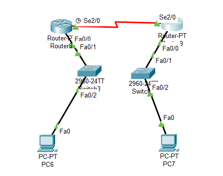
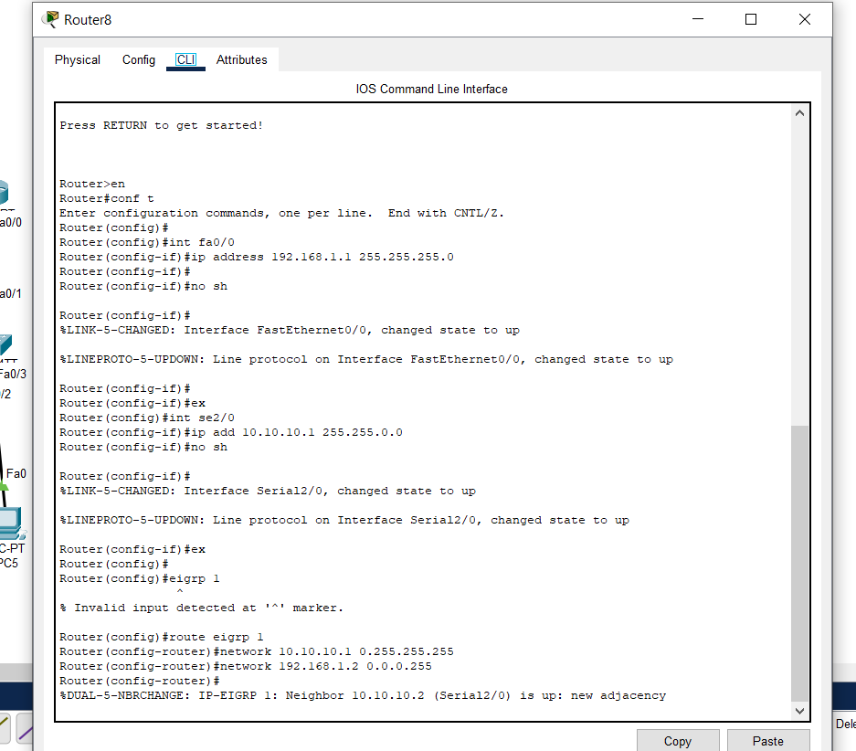
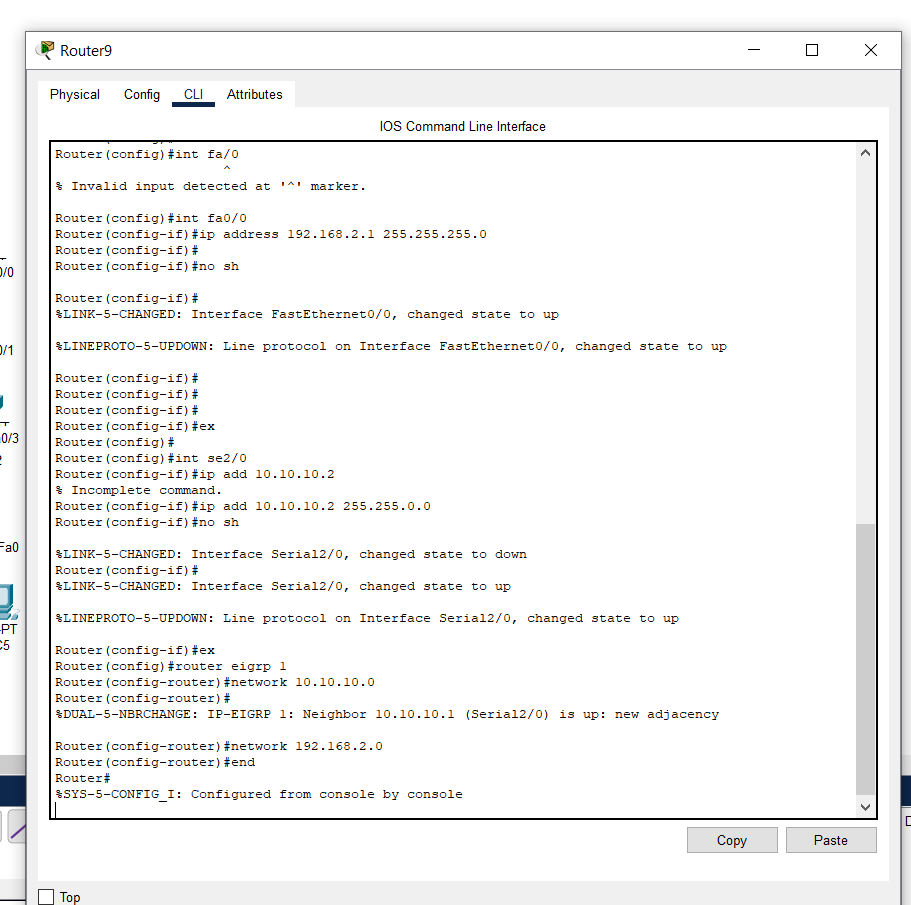
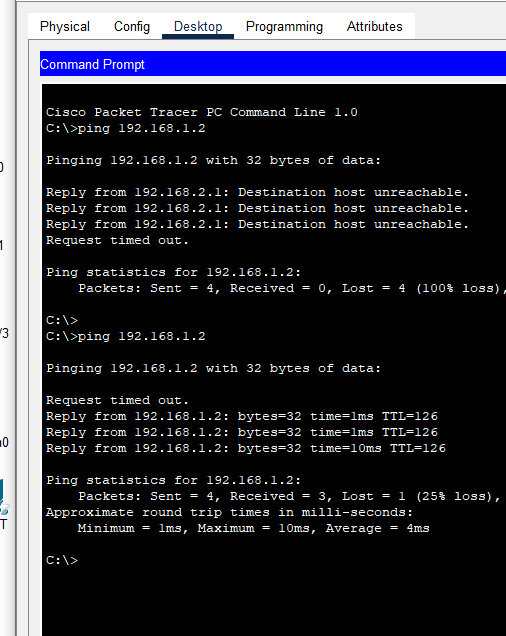

# 🛰️ EIGRP Simple Simulation

A minimal yet practical Cisco Packet Tracer project demonstrating **EIGRP (Enhanced Interior Gateway Routing Protocol)** configuration between multiple routers in a small network topology.



---

## 📘 Project Overview

This project focuses on implementing **EIGRP** routing across multiple routers to enable dynamic routing between different networks.  
It’s a simplified example perfect for students or beginners learning about **EIGRP fundamentals** in a simulated environment.

### Key Concepts
- Basic **router interconnection**
- **EIGRP autonomous system** setup
- **Network advertisement**
- **Routing table verification**

---

## 🧩 Network Topology

| Device | Interface | IP Address | Connected To |
|--------|------------|-------------|---------------|
| Router0 | Fa0/0 | 192.168.10.1 | Switch0 |
| Router0 | Se0/0/0 | 10.10.10.1 | Router1 |
| Router1 | Se0/0/0 | 10.10.10.2 | Router0 |
| Router1 | Fa0/0 | 192.168.20.1 | Switch1 |
| PCs | DHCP / Static IP | - | Corresponding Router |

---

## ⚙️ Configuration Steps

### 🖥️ Router 0 Configuration
```bash
Router> enable
Router# configure terminal
Router(config)# interface fa0/0
Router(config-if)# ip address 192.168.10.1 255.255.255.0
Router(config-if)# no shutdown
Router(config)# interface se0/0/0
Router(config-if)# ip address 10.10.10.1 255.255.255.0
Router(config-if)# no shutdown
Router(config)# router eigrp 100
Router(config-router)# network 192.168.10.0
Router(config-router)# network 10.10.10.0
Router(config-router)# end
Router# write memory
````

### 🖥️ Router 1 Configuration

```bash
Router> enable
Router# configure terminal
Router(config)# interface fa0/0
Router(config-if)# ip address 192.168.20.1 255.255.255.0
Router(config-if)# no shutdown
Router(config)# interface se0/0/0
Router(config-if)# ip address 10.10.10.2 255.255.255.0
Router(config-if)# no shutdown
Router(config)# router eigrp 100
Router(config-router)# network 192.168.20.0
Router(config-router)# network 10.10.10.0
Router(config-router)# end
Router# write memory
```

---

## 🧠 EIGRP Verification

Check EIGRP neighbor relationships and routing tables using:

```bash
show ip route
show ip eigrp neighbors
show ip protocols
```

### Example Outputs

| Router      | CLI Output                      |
| ----------- | ------------------------------- |
| **Router0** |  |
| **Router1** |  |

---

## 🧪 Connectivity Test

After successful EIGRP configuration, test the connection between PCs in both networks.

Example successful ping:



---

## 📁 Folder Structure

```
/assets/
 ├── topology.png        # Network topology diagram
 ├── CLI1.png            # Router0 CLI output
 ├── CLI2.png            # Router1 CLI output
 ├── Success.png         # Successful ping result
 └── EIGRP-Simple.pkt    # Cisco Packet Tracer project file
```

---

## 🎯 Learning Goals

By completing this lab, you’ll understand how to:

* Configure **EIGRP** on Cisco routers
* Establish **neighbor adjacency**
* Verify routing using CLI commands
* Test connectivity across networks dynamically

---

## 🧰 Requirements

* **Cisco Packet Tracer** (v7.0+ recommended)
* Basic understanding of:

  * IP addressing
  * Router interfaces
  * EIGRP concepts

---

## 📝 Notes

* Ensure all interfaces are **up/up** before enabling EIGRP.
* Verify the **autonomous system number (AS 100)** matches on all routers.
* You can extend this project by adding another router or subnet for advanced EIGRP scenarios.

---

## 🚀 Quick Preview

> Full topology and configurations are provided in the `/assets/` folder.
> Just open the `.pkt` file in Cisco Packet Tracer and start exploring!

---


---

## 💻 Full CLI Base Configuration (Dual Router Setup)

Below is the complete **base configuration** for a simple **EIGRP dual-router** topology.  
This example uses the following addressing scheme:

| Device | Interface | IP Address | Description |
|--------|------------|-------------|--------------|
| **Router 1 (R1)** | FastEthernet0/0 | 192.168.10.1 | LAN for PC1 |
|                   | Serial0/0/0 | 10.10.10.1 | Link to Router 2 |
| **Router 2 (R2)** | FastEthernet0/0 | 192.168.20.1 | LAN for PC2 |
|                   | Serial0/0/0 | 10.10.10.2 | Link to Router 1 |
| **PC1** | NIC | 192.168.10.2 / 24 | Connected to R1 |
| **PC2** | NIC | 192.168.20.2 / 24 | Connected to R2 |

---

---

## 💻 Full CLI Base Configuration (Dual Router Setup)

Below is the complete **base configuration** for a simple **EIGRP dual-router** topology.  
This example uses the following addressing scheme:

| Device | Interface | IP Address | Description |
|--------|------------|-------------|--------------|
| **Router 1 (R1)** | FastEthernet0/0 | 192.168.10.1 | LAN for PC1 |
|                   | Serial0/0/0 | 10.10.10.1 | Link to Router 2 |
| **Router 2 (R2)** | FastEthernet0/0 | 192.168.20.1 | LAN for PC2 |
|                   | Serial0/0/0 | 10.10.10.2 | Link to Router 1 |
| **PC1** | NIC | 192.168.10.2 / 24 | Connected to R1 |
| **PC2** | NIC | 192.168.20.2 / 24 | Connected to R2 |

---

### 🧩 Router 1 (R1) – Configuration

```bash
Router> enable
Router# configure terminal

! Configure LAN Interface
Router(config)# interface FastEthernet0/0
Router(config-if)# ip address 192.168.10.1 255.255.255.0
Router(config-if)# no shutdown
Router(config-if)# exit

! Configure Serial Link to Router 2
Router(config)# interface Serial0/0/0
Router(config-if)# ip address 10.10.10.1 255.255.255.0
Router(config-if)# clock rate 64000
Router(config-if)# no shutdown
Router(config-if)# exit

! Configure EIGRP (Autonomous System 100)
Router(config)# router eigrp 100
Router(config-router)# network 192.168.10.0 0.0.0.255
Router(config-router)# network 10.10.10.0 0.0.0.255
Router(config-router)# no auto-summary
Router(config-router)# end

! Verify and save
Router# show ip route
Router# write memory
````

---

### 🧩 Router 2 (R2) – Configuration

```bash
Router> enable
Router# configure terminal

! Configure LAN Interface
Router(config)# interface FastEthernet0/0
Router(config-if)# ip address 192.168.20.1 255.255.255.0
Router(config-if)# no shutdown
Router(config-if)# exit

! Configure Serial Link to Router 1
Router(config)# interface Serial0/0/0
Router(config-if)# ip address 10.10.10.2 255.255.255.0
Router(config-if)# no shutdown
Router(config-if)# exit

! Configure EIGRP (Autonomous System 100)
Router(config)# router eigrp 100
Router(config-router)# network 192.168.20.0 0.0.0.255
Router(config-router)# network 10.10.10.0 0.0.0.255
Router(config-router)# no auto-summary
Router(config-router)# end

! Verify and save
Router# show ip route
Router# write memory
```

---

### 🧠 PC Configuration

#### PC1 (connected to R1)

```
IP Address: 192.168.10.2  
Subnet Mask: 255.255.255.0  
Default Gateway: 192.168.10.1
```

#### PC2 (connected to R2)

```
IP Address: 192.168.20.2  
Subnet Mask: 255.255.255.0  
Default Gateway: 192.168.20.1
```

---

### 🧪 Verification Commands

After both routers are configured, verify EIGRP operation:

```bash
show ip route
show ip eigrp neighbors
show ip protocols
```

---

### ✅ Expected Results

1. **EIGRP neighbor adjacency** should form between R1 and R2.
2. **Routing table** on both routers should contain each other’s LAN networks.
3. **Ping from PC1 → PC2** should return successful replies.

Example successful connectivity test:


---

```
